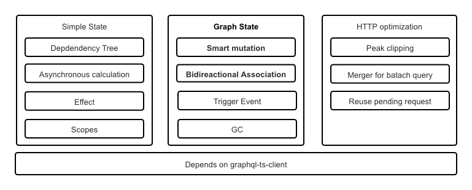

# A new react state management framework

## Introduce


1. Simple state

2. Graph state

3. Http optimization


### 1. GraphQL style but not only GraphQL
   
1. If the server is not implemented based on GraphQL, the client will simulate a GraphQL implementation based on REST requests(Not implemented in 0.0.1).

### 2. No unnecessary re-rendering 

Like recoil, each state is an individual piece of state, your components can subscribe to state. When the value changes only the related components are re-renders.

### 3. Not only normalized cache, but also more database-like solution

The state management of this framework is divided into two parts

1. simple-state: its API looks like recoil.
2. graph-state: it looks like database.

graph-state is the core value of this framework.

#### 3.1. Intelligent object association maintenance

In the past, when using the GraphQL client with cache, the greatest pain developers faced was the need to decide whether to update the local cache or re-query after the mutation operation. If you choose to modify the local cache, you will face a heavy workload; if you choose to re-query, not only will you accept performance defects, but it will also be difficult to determine which queries need to be refetched.

The built-in cache database of this framework is highly intelligent. You only need to simply update it with the information returned by the server, it will first try to find out all other related objects that may be affected, then update the local data and modify the relationship between the old and new data; if this attempt is not feasible, it will automatically upgrade to re-query behavior and automatically determine which queries need to be refetched.


Regardless of whether the framework chooses a better strategy for modifying local data **(A)** or a poor requery strategy **(B)**. They are all automated and do not require your intervention.

However, you can also intervene in it. You can use simple APIs to help it optimize, increase the probability of case **(A)** and decrease the probability of case **(B)**.

#### 3.2. Bidirectonal association maintenance

Although from the perspective of a single UI component, one-way associations between objects are concerned. However, the cache is shared by all UI components, and the data of these components will be merged inside the cache, and finally a two-way association will inevitably appear in the cache. If the two-way association cannot be handled well, data inconsistency will occur between different components. In fact, the maintenance of two-way association is one of the foundations of the intelligence of this framework.

Bidirectonal association is supported and the symmetry of bidirectonal association is strictly guaranteed. Developers can modify one end of the  bidirectonal association at will. If the other end has been cached, the other one will be automatically updated to guarantee the symmetry of the association and the consistency of the data. 


#### 3.3. Database style trigger
The built-in cache database supports triggers. Not only does the framework use it internally to achieve the purpose of data intelligent maintenance, the triggers are also exposed as public APIs so that developers can customize more intelligent behaviors.


### 4. HTTP optimization

The framework has built-in optimization strategies to reduce the number of HTTP requests

1. Peak clipping: Users can quickly change the query conditions, but asynchronous requests will be sent out as slowly as possible. The system guarantees that the last HTTP request uses the parameters entered last time by the user.

2. Object/objects queries base on id/ids are easy to repeat between different UI components, if not optimized, it will lead to fragmentation of HTTP requests. As long as different components query object/objects by same shape, the id/ids parameters specified by different components will be merged together, and finally one merged batch request will be sent.

3. For multiple queries with the same variables but different shapes, queries with smaller shapes will not send out HTTP requests, they will borrow the HTTP request of the query with the largest shape to share the response data. Even if the HTTP request for the query with the largest shape has been sent and is in the pending state, this optimization is still effective.


### 5. Not only gobal state, but also scopes

This framework introduces scope similar to programming languages. In addition to the global scope, any react component can choose to open a child scope.

This design is useful for some states such as "selectedXXX"

## Run the example
1. Clone this project
```
git clone https://github.com/babyfish-ct/graphql-state.git
```
2. Start server
```
cd ${clonedDir}/example/server
yarn start
```
The server mock data in memory, when it's restarted, all the data will be restored.

3. Start client
```
cd ${clonedDir}/example/client
yarn start
```
Access http://localhost:3000

## Dependencies
1. React, version >= 17.0.0
2. [graphql-ts-client](https://github.com/babyfish-ct/graphql-ts-client), version >= 3.0.8

[graphql-ts-client](https://github.com/babyfish-ct/graphql-ts-client) is another framework created by me a few months ago, it's TypeScript-DSL for GraphQL with full features.

## Schedules

This is the first version 0.0.0, and there is still some work to be done in the future.

### Short-term goal
1. Doucment **(Emergency)**
2. Cascade deleting for non-null many-to-assocaition
3. Preload async state
4. Support RestNework for REST server

### Long-term goal
1. Transaction, save point, undo/redo 
2. Chrome extension for data visualization


## Change Log
|Version|Description|
|-------|-----------|
|0.0.1  |GC for built-in cache database|
|0.0.2  |Support usePaginationQuery| 
