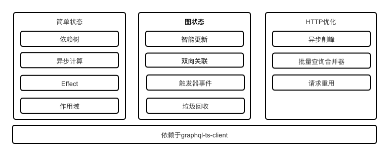

# 一个新的React状态管理框架

## 语言: [English](https://github.com/babyfish-ct/graphql-state) | 中文

## 1. 系统功能



### 1.1. 简单状态
一套看起来非常类似于recoil的状态管理，用于管理业务对象模型以外的零散数据，可以方便地和图状态配合。

### 1.2. 图状态
本框架的核心价值，提供智能性远高于apollo-client和relay的图状态管理能力。这也是我创建此框架的动机。

图状态管理支持两个核心功能
#### 1.2.1. 智能更新

在使用传统的GraphQL客户端时，开发者面临的最大痛苦，是需要在变更操作后决定究竟应该更新本地缓存还是重新查询数据。如果选择修改本地缓存，将面临繁重的工作量；如果选择重新查询，不仅需要接受性能缺陷，而且确定哪些查询需要被重新执行也非易事。

这个框架内置的缓存数据库是高度智能的。你只需要简单地用服务端的返回信息去更新它，它就会分析新数据对现有缓存的影响程度，尽量争取只修改本地缓存；如果这种努力不可行，当前操作就会被自动升级为重新查询行为并自动找出所有需要被重新执行的查询。


无论框架是选择仅修改本地数据这个更好的策略(A)，还是重新查询这个不太好的策略(B)。它们都是全自动的，不需要您的干预。

然而，如果你愿意的话，你也可以干预抉择过程。您可以使用简单的API来帮助它优化，增加情况(A)的发生概率并降低情况(B)的发生概率。

#### 1.2.2. 用户不给予优化时

让我们来看一个因用户不给予优化而导致无法通过仅修改本地缓存来完成变更的例子，GIF动画如下

||
|---|

当我们把"MANNING-1"修改成"MANNING-2"的时候，在缺少用户优化的情况下，带参数的两个缓存项被清除。所以，带参数的查询会自动从服务端重新获取新的数据。

#### 1.2.3. 用户给予优化时

让我们来看一个因用户优化的支持而无需重新查询仅需修改本地缓存就可以完成变更的例子，GIF动画如下

||
|---|

当我们把"MANNING-1"修改成"MANNING-2"的时候，在用户优化的支持下，带参数的两个缓存项被直接更新，而不是被清除。所以，带参数的查询会马上呈现了最新结果，无需重新查询。

> 注意，这里涉及到了3个缓存项
> 
> - Query.findBooksStores()
> - Query.findBooksStores({name: "1"})
> - Query.findBooksStores({name: "2"})
> 
> 实际项目中，被UI抛弃的数据可能会在较短时间内被垃圾回收系统释放。在这个例子中，为了达到演示效果，故意调整了垃圾释放策略，让这三个数据都可以相对长时间地在缓存中同时存在。

#### 1.2.4. 智能排序

如上面的GIF动画所示，graphql-state能自动根据数据的变更重新实施条件筛选。不仅如此，graphql-state还能自动根据数据的变更重新实施排序，如下GIF动画所示

||
|---|

本例中我们关心两个关联
- Query.findBooks
- BookStore.books

这两个关联都按照name升序排序。所以，当对象的name被修改时，这两个关联都会被重新排序。

### 1.2.5. 双向关联管理

上文中，我们展示几个很酷的效果。不仅如此，graphql-state还能处理不同数据关联之间的相互影响。这就是双向关联维护。

参考这样一个例子
- BookStore具备一个books属性，一个指向Book的one-to-many关联
- 反过来，Book具备一个store属性，一个指向BookStore的many-to-one关联

从业务上讲，BookStore.books和Book.store其实是同一个关联因视角不同而展现出的两面，因此，graphql-state允许你把这样的两个关系绑定为双向关联。一旦你完成了这种绑定，你就可以得到如下GIF动画所示的效果

||
|---|

在这个例子中，你执行的修改行为是
```
MANNING.books.add(LearningGraphQL);
```
与此同时，graphql-state会为你执行两个自动更新
```
if (cached(O'REILLY.books)) {
    O'REILLY.books.remove(LearningGraphQL);
}
if (cached(LearningGraphQL.store)) {
    LearningGraphQL.store = MANNING;
}
```

### 1.2.6. 数据库风格的触发器

内置缓存数据库支持触发器。不仅框架内部使用它来实现数据智能维护，触发器也作为公共API暴露出来，让开发者可以自定义更多的智能行为。

## 1.3. HTTP优化

框架内置优化策略，减少HTTP请求次数

1. 削峰：用户可以快速改变查询条件，但异步请求会尽可能慢地发出。系统保证最后一次HTTP请求使用的是用户上次输入的参数。

2. 基于id/ids的object/objects查询很容易在不同的UI组件之间重复，如果不优化，会导致HTTP请求碎片化。只要不同的组件以相同的shape查询一个/多个对象，就会将不同组件指定的id/ids参数合并在一起，最后发送一个合并的批处理请求。

3. 对于变量相同但形状不同的多个查询，形状较小的查询不会发出HTTP请求，它们会借用形状最大的查询的HTTP请求来共享响应数据。即使对于最大shape的查询的HTTP请求已经发送并且处于pending状态，这种优化仍然有效。 

## 2. 运行附带例子
1. 克隆本项目
```
git clone https://github.com/babyfish-ct/graphql-state.git
```
2. 启动服务端
```
cd ${clonedDir}/example/server
yarn start
```
服务端在内存中模拟数据库, 当它没重启时，所有数据会被还原.

3. 启动客户端
```
cd ${clonedDir}/example/client
yarn start
```
访问 http://localhost:3000

## 3. [开始使用: 逐步向导](./get-start.md)

## 4. [文档](./doc/README_zh_CN.md)

- [简单状态](./doc/simple-state/README_zh_CN.md)
  - [可写状态](./doc/simple-state/writable_zh_CN.md)
  - [计算状态](./doc/simple-state/computed_zh_CN.md)
  - [异步状态](./doc/simple-state/async_zh_CN.md)
  - [Effect](./doc/simple-state/effect_zh_CN.md)
  - [作用域](./doc/simple-state/scope_zh_CN.md)
- [图状态](./doc/graph-state/README_zh_CN.md)
  - [查询](./doc/graph-state/query/README_zh_CN.md)
    - [useQuery](./doc/graph-state/query/useQuery_zh_CN.md)
    - [usePaginationQuery](./doc/graph-state/query/usePaginationQuery_zh_CN.md)
    - [useObject&useObjects](./doc/graph-state/query/useObject_zh_CN.md)
  - [变更](./doc/graph-state/mutation/README_zh_CN.md)
    - [变更缓存](./doc/graph-state/mutation/mutate-cache_zh_CN.md)
    - [useMutation](./doc/graph-state/mutation/useMutation_zh_CN.md)
    - [智能变更](./doc/graph-state/mutation/smart-mutation_zh_CN.md)
    - [双向关联](./doc/graph-state/mutation/bidirectional-association_zh_CN.md)
  - [触发器](./doc/graph-state/trigger_zh_CN.md)
- [释放策略](./doc/release-policy_zh_CN.md)
- [HTTP优化](./doc/http-optimization/README_zh_CN.md)
  - [异步削峰](./doc/http-optimization/peak-clipping_zh_CN.md)
  - [碎片合并](./doc/http-optimization/merge-fragment_zh_CN.md)
  - [请求重用](./doc/http-optimization/reuse-request_zh_CN.md)

## 5. 依赖
1. React, version >= 17.0.0
2. [graphql-ts-client](https://github.com/babyfish-ct/graphql-ts-client), version >= 3.0.8

[graphql-ts-client](https://github.com/babyfish-ct/graphql-ts-client) 是我数月前开发的另外一个框架, 它是针对GraphQL功能完整的的TypeScript-DSL

## 6. 其它

这是一个新诞生的框架，为了让它越来越完整，未来会实现的功能如下

### 未来
#### 短期目标

1. 支持级联删除，对非空的many-to-one关联而言，这是唯一的选择
2. 预先加载查询
3. 基于REST服务模拟GraphQL服务，这对遗留的服务端项目很有用

#### 长远目标
1. 事务、保存点、撤销/重做 
2. 支持数据可视化的Chrome插件


### 7. [变更日志](./change-log.md)

