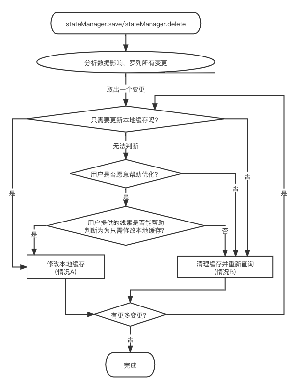

# [graphql-state](https://github.com/babyfish-ct/graphql-state)/[文档](../README_zh_CN.md)/[图状态](../README_zh_CN.md)/[变更](./README.md)/智能变更

智能更新更新流程如下



此图图在首页中已经讨论过了，这里不再赘述。

本文档重点讨论两点：

- 框架如何抉择只需修改本地数据还是需要重新查询?
- 如果用户愿意介入抉择过程，他应该如何参与优化?

## 1. 基本概念

### 1.1. 关联族和子关联

在GraphQL中，关联是具备参数的，以[附带例子的服务端](https://github.com/babyfish-ct/graphql-state/tree/master/example/server)为例，其提供的服务定义如下

```
type Query {
    findBookStores(name: String): [BookStore!]!
    ...
}
type BookStore {
    books(name: String): [Book!]!
    ...
}
...
```

我们看到，Query.findBookStores和Book.authors都是参数化的。统一个关系，可以由不同参数的创建不同的实例，比如

```
----+-Query.findBookStores
    |
    +---- Query.findBooksStores()
    |
    +---- Query.findBooksStores({name: "a"})
    |
    \---- Query.findBooksStores({name: "b"})

----+- Book.authors
    |
    +---- Book.authors()
    |
    +---- Book.authors({name: "a"})
    |
    \---- Book.authors({name: "b"})
```

如上图，我们有两个关联族，每个族中有三个子关联

### 1.2 link和unlink

清观察下面的代码
```
stateManager.save(

    bookStore$
    .id
    .books(
        { name: ParameterRef.of(bookName) },
        author$.id
    ),
    
    {
        id: storeId,
        books: [
            {id: id3 }, 
            {id: id4 }, 
            {id: id5 },
            {id: id6 },
            {id: id7 }
        ]
    }
    
    { bookName: "a" }
)
```
这段代码试图修改id为storeId的BookStore对象的子关联books({name: "a"})

假如books({name: "a"})现在的旧值为[id1, id2, id3, id4, id5]，而期望修改的新值为[id3, id4, id5, id6, id7]。对比新旧数据，被删除的book为[id1, id2]，被添加的书为[id6, id7]。

当前BookStore对象，除了具备当前的books({name: "a})这个子关联外，还有另外两个子同族的子关联books()，books({name: "b"})，接下来，框架即将尝试
```
books().tryUnlink({
    ids: [id1, id2], 
    reason: {name: "a}
});
books().tryLink({
    ids: [id6, id7], 
    reason: {name: "a}
});
books({name: "b"}).tryUnlink({
    ids: [id1, id2], 
    reason: {name: "a}
});
books({name: "b"}).tryLink({
    ids: [id6, id7], 
    reason: {name: "a}
});
```
这说明，books({name: "a"})的变化有可能对books()和books({name: "b"})形成影响

--------------------------------

[< 上一篇: useMutation](./useMutation_zh_CN.md) | [返回上级：变更](./README_zh_CN.md) | [下一篇：双向关联](./bidirectional-association_zh_CN.md)
