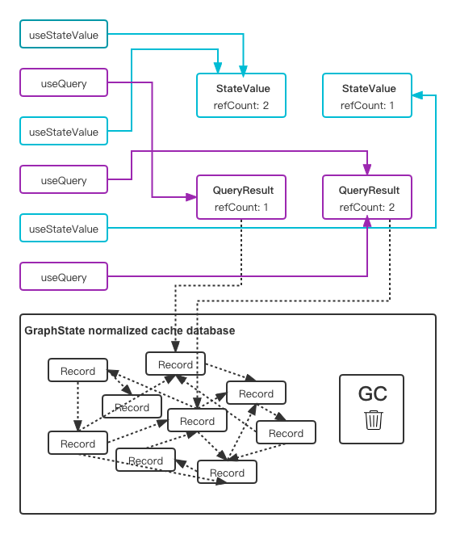

# [graphql-state](https://github.com/babyfish-ct/graphql-state)/[文档](./README_zh_CN.md)/释放策略

状态关系需要消耗浏览器的内存资源，需要不停地把这些宝贵的资源归还浏览器，网站才能可持续地运行下去

graphql-state的内存结构如下



可以分为两个部分

- 引用计数可以管理的部分
  - useStateValue, useStateAccessor函数引用简单状态StateValue。
  - useQuery, usePaginationQuery, useObject, useObjects函数引用查询结果QueryResult。
  
  虽然计算状态和异步状态会导致StateValue对其他StateValue或QueryResult形成依赖，但这种依赖是树形依赖，不是图形依赖，没有循环引用的问题，因此，对StateValue和QueryResult这些数据对象而言，引用计数内存管理是可行的
  
- 必须必须垃圾回收的部分
  框架内置了图数据的缓存数据，其中存放复杂对象的normalize数据，类似于关系型数据库。这些数据之间的相互引用关系错综复杂，循环引用常常出现。对这部分数据而言，必须使用垃圾回收策略。

-----------
[< 上一篇：图状态](./graph-state/README_zh_CN.md) | [返回上级：文档](./README_zh_CN.md) | [下一篇：HTTP优化器>](./http-optimization/README_zh_CN.md)
```
